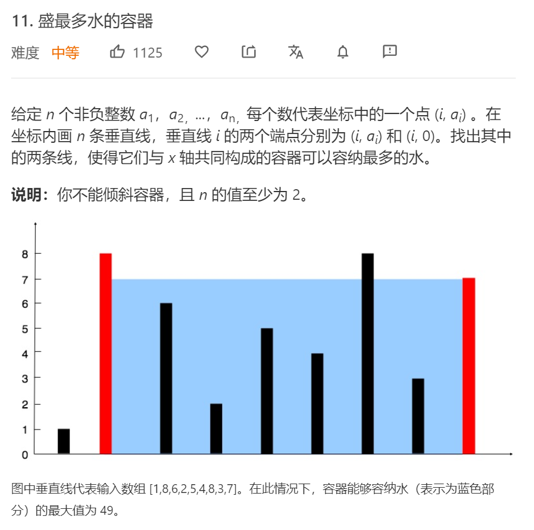

# 11盛水最多的容器

## 题目

## 思路

根据以下事实：

1. 确定左右边界后即可确定水槽的盛水量
2. 盛水量由较短边界决定

设置双指针分别指向两端边界，每一轮收缩较短边界，比较盛水量，遍历一遍即可

---

收缩较短边界的不会漏解的说明：
盛水量由较短边界和边界距离共同决定，每次收缩较短边界，边界距离减1，较短边界边长可能边长，从而得到更大的面积。
若收缩较长边界，则短板不变或变短，此时边界距离一定变小，则不可能得到更大面积。

## 代码

    class Solution:
        def maxArea(self, height: List[int]) -> int:
            i, j = 0, len(height)-1
            area = 0
            while i != j:
                area = max(area, min(height[i],height[j])*(j-i))
                if height[i] > height[j]: j -= 1
                else: i += 1
            return area
