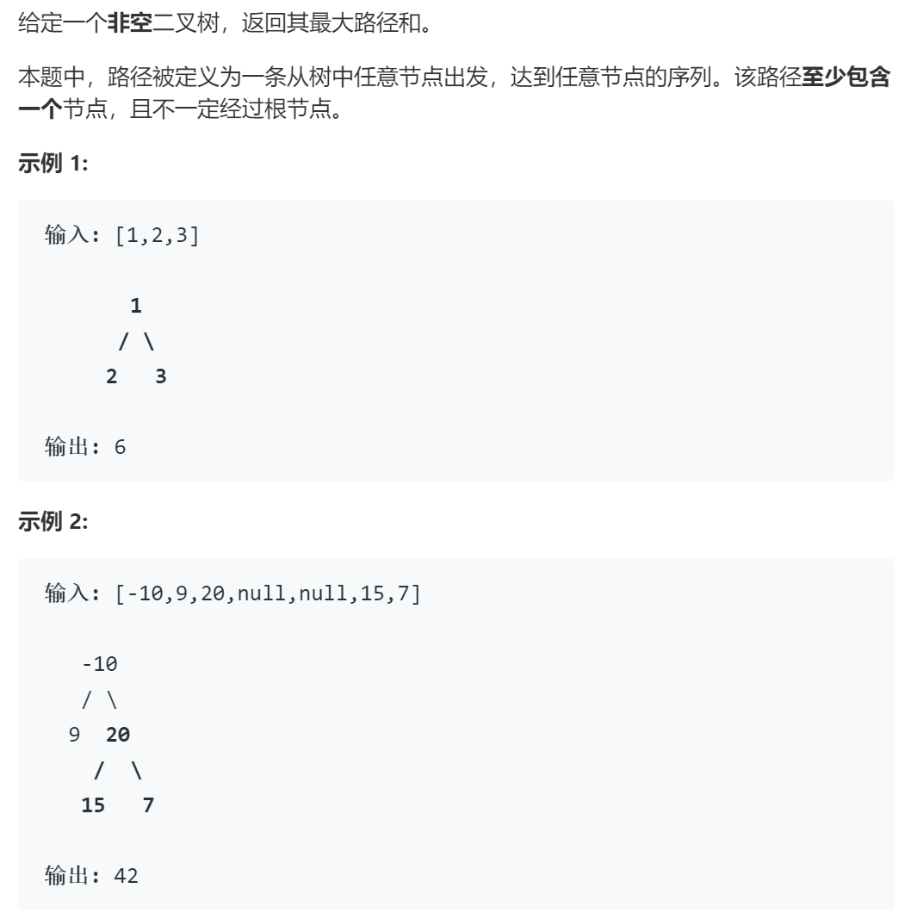

# 124二叉树中的最大路径和

## 题目

## 思路

1. 二叉树问题可优先递归
2. 在每个节点处最大路径和的组成  
   2.1 当前根节点与左节点  
   2.2 当前根节点与右节点  
   2.3 当前根节点与左右节点  

## 代码

    class Solution:
        def maxPathSum(self, root: TreeNode) -> int:
            '''        
            1. 二叉树问题可优先递归
            2. 在每个节点处最大路径和的组成
                2.1 当前根节点与左节点
                2.2 当前根节点与右节点
                2.3 当前根节点与左右节点
            '''
            self.res = float("-inf")

            def helper(root):
                if not root: return 0 # 空节点最大路径和为0

                left = helper(root.left) # 递归左子树
                right = helper(root.right) # 递归右子树
                # 这里考虑了情况 2.3, 等同将当前节点加入路径，形成左子树-根-右子树这样的路径是否会获得更大的路径和
                self.res = max(self.res, left+right+root.val) 
                # 返回时 考虑了情况2.1 2.2 将这两种情况返回上一层，尝试2.3的情况并进行对比，若该分支为负，则取0表示不选取这一路径
                return max(0, max(left,right)+root.val) 
            
            helper(root)
            return self.res

## 复杂度

时间复杂度 从叶节点到根节点每个节点都会遍历一次 O(n)  
空间复杂度 取决于树的高度 O(h)
