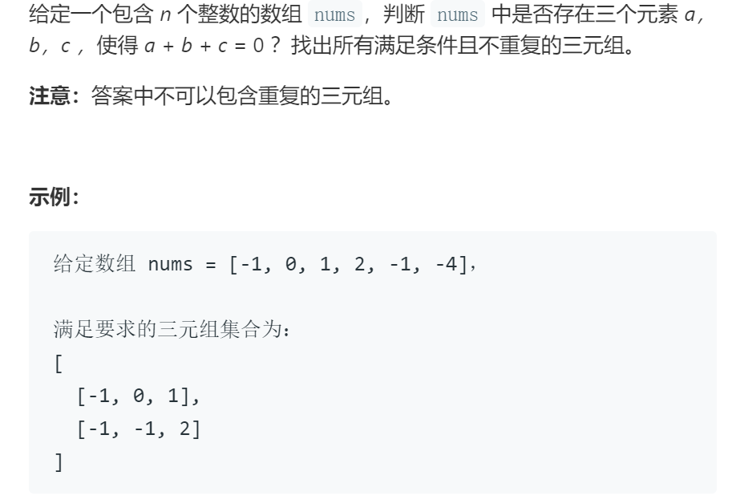

# 三数之和

## 题目

## 代码

    class Solution:
        def threeSum(self, nums: List[int]) -> List[List[int]]:

            if len(nums)<3: # 特判，nums小于三个数时，直接返回空集
                return []
            
            nums.sort() # 对数组进行排序，便于处理重复数字的情况
            res=[]

            for i in range(len(nums)):
                if nums[i]>0: return res # 由于数组已排过序，若i指针大于0，l与r一定大于0，不可能再出现满足题意的解
                if i>0 and nums[i]==nums[i-1]: continue # 跳过重复元素，避免重复的解
                l = i+1 # 左指针，指向较小的数
                r = len(nums)-1 # 右指针，指向较大的数
                
                while l<r: # 对于每一个位置的i，进行如下遍历，找到可能的l与r
                    tmp = nums[i]+nums[l]+nums[r]
                    if tmp==0: 
                        res.append([nums[i], nums[l], nums[r]]) # 如果符合题意则加入解集
                        while l<r and  nums[l]==nums[l+1]: l+=1 # 跳过重复解
                        while l<r and  nums[r]==nums[r-1]: r-=1
                        l+=1 
                        r-=1                    
                    elif tmp>0: r-=1 # 若大于0则缩小大指针
                    else: l+=1 # 若小于0则缩小小指针
            return res
