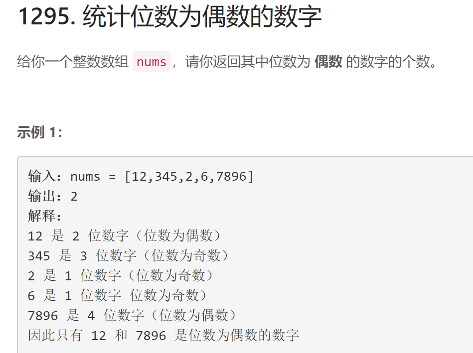
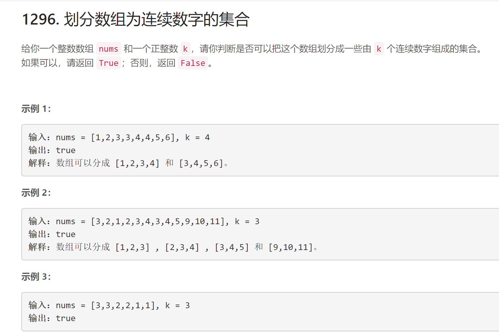

# 168周赛

## 题目1

## 代码1

    class Solution:
        def findNumbers(self, nums: List[int]) -> int:
            res = 0
            for i in range(len(nums)):
                if len(str(nums[i])) % 2 == 0:
                    res+=1
            return res

## 题目2

## 代码2

    class Solution:
        def isPossibleDivide(self, nums: List[int], k: int) -> bool:
            '''
                1. 验证数组长度是否为k的倍数
                2. 对数组排序
                3. 按如下规则划分数组
                    3.1 若数字连续，则分配至同一数组
                    3.2 若数字相同，则分配至不同数组
                4. 验证每个数组是否为连续的
            '''
            if len(nums)%k != 0: return False
            res = [[0 for i in range(2)] for j in range(len(nums)//k)] # 数组res由二元组组成，第一个数字表示当前容量，第二个数值表示数组中在最后一个数字
            nums.sort() # 对数组进行排序
            start,flag = 0, 0
            res[0][0],res[0][1] = 1, nums[0]
            delta = 1
            
            for i in range(1, len(nums)):
                if res[start][0] == k:  # 如果一个数组满，则从下一个开始考虑
                    start+=1
                    flag = 1
                else: flag = 0 # 用flag表示是否因满数组而选取了下一个数组，在处理重复元素时需要使用
                j = start
                if flag==0 and nums[i] == nums[i-1]:  # 当元素重复时，利用delta分配给后续的res数组而不是当前数组
                    if j + delta == len(nums)//k: return False
                    if  res[j+delta][0]==0 or nums[i]==res[j+delta][1]+1:
                        res[j+delta][0]+=1
                        res[j+delta][1] = nums[i]
                        delta += 1
                        continue
                    else: return False
                if res[j][0]==0 or nums[i]==res[j][1]+1: # 当元素不重复是，只需判断插入当前数组后是否连续
                    delta = 1
                    res[j][0]+=1
                    res[j][1] = nums[i]
                else: return False
            

            if res[len(nums)//k-1][0]!=k: return False
            return True