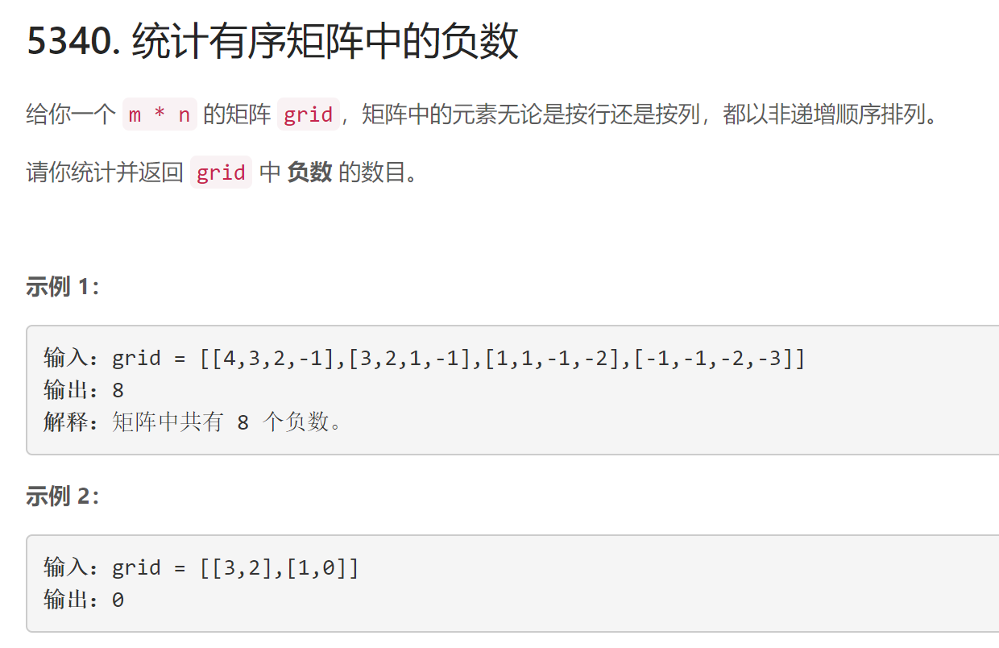
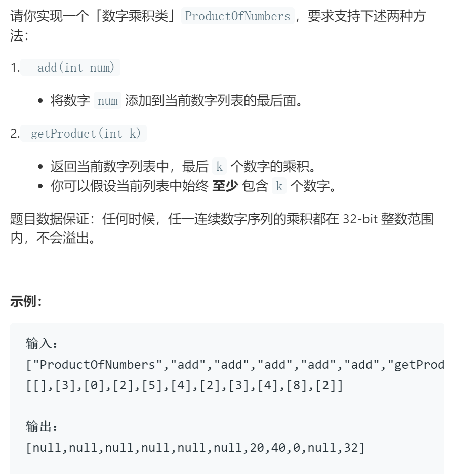
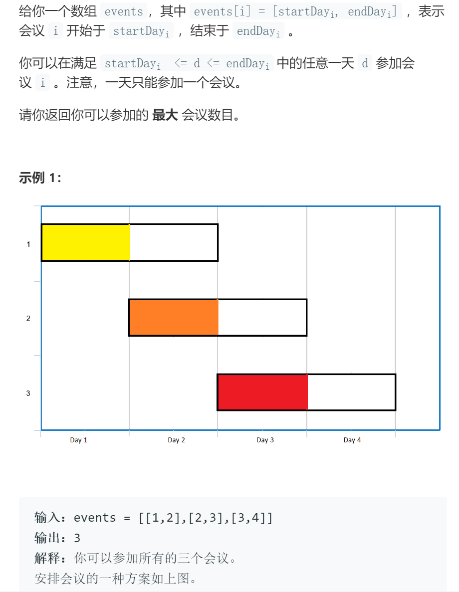
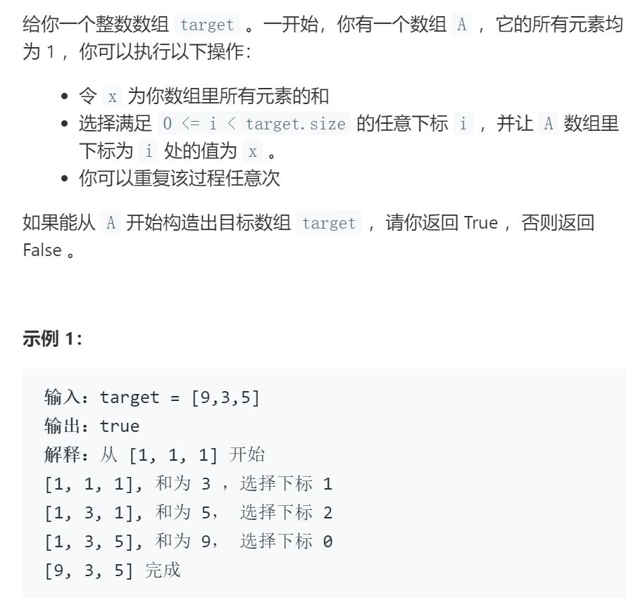

# 176周赛

## 5340统计矩阵中的负数

### 题目

### 代码

    class Solution:
        def countNegatives(self, grid: List[List[int]]) -> int:
            m = len(grid)
            n = len(grid[0])
            count = 0
            for i in range(m-1,-1,-1):
                for j in range(n):
                    if grid[i][j] <0:
                        count += n-j
                        break
                if grid[i][n-1]>=0: break
            return count

## 5341最后K个数的乘积

### 题目

### 代码

**不超时的关键在于利用除法，通过逆运算求出最后k个数的乘积**

    class ProductOfNumbers:
        def __init__(self):
            self.nums = [1] # nums不存储add的数列，而是用于存储最后n个数字的乘积

        def add(self, num: int) -> None:
            if num == 0: # 当遇到0时，此时后n个数字的乘积为0，将nums数组恢复原始状态
                self.nums = [1]
            else: # 否则计算乘积
                self.nums.append(self.nums[-1] * num)

        def getProduct(self, k: int) -> int:
            # 当k大于当前等于当前数组长度时，意味着k个数中有0，乘积直接返回0即可
            # 若k小于当前数组长时，可以利用除法得到最后k个数的乘积
            return 0 if k>=len(self.nums) else self.nums[-1]//self.nums[-k-1]

    # Your ProductOfNumbers object will be instantiated and called as such:
    # obj = ProductOfNumbers()
    # obj.add(num)
    # param_2 = obj.getProduct(k)

## 5342最多可以参加的会议数目

### 题目

### 代码

    class Solution:
        def maxEvents(self, events: List[List[int]]) -> int:
            events.sort(key = lambda x:x[1], reverse=False) # 将会议按（结束时间，开始时间）字典序升序
            s = set()
            # 先参加结束早的会议
            for event in events:
                for i in range(event[0],event[1]+1):
                    if i not in s:
                        s.add(i)
                        break
            return len(s)

## 5343多次求和构造目标数组

### 题目

### 代码

    class Solution:
        def isPossible(self, target: List[int]) -> bool:
            # 根据构造规则反向逆推
            # 若最终可以推回最初状态，则说明可以构造成功
            while(True):
                target_max = max(target) # 最后一次构造的数字一定是最大的
                max_index = target.index(target_max) # 记录这个数字的索引便于接下来修改
                target_max = target_max * 2 - sum(target) # 逆推回上一步
                target[max_index] = target_max # 将这个数字改为上一步，即整个数组还原为上一个状态
                if target_max==1 and sum(target)==len(target): return True # 刚还可以推回最终状态，说明可以构造成功
                if target_max < 1: return False