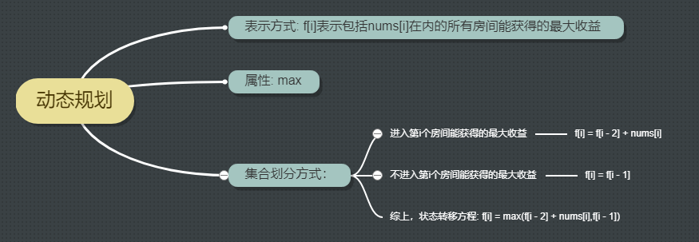

# 198打家劫舍

## [题目](https://leetcode-cn.com/problems/house-robber/)

你是一个专业的小偷，计划偷窃沿街的房屋。每间房内都藏有一定的现金，影响你偷窃的唯一制约因素就是相邻的房屋装有相互连通的防盗系统，如果两间相邻的房屋在同一晚上被小偷闯入，系统会自动报警。

给定一个代表每个房屋存放金额的非负整数数组，计算你 不触动警报装置的情况下 ，一夜之内能够偷窃到的最高金额。

## 思路

## 代码

    class Solution:
        def rob(self, nums: List[int]) -> int:
            if not nums: return 0
            if len(nums) == 1: return nums[0]
            f = [0 for i in range(len(nums))]
            f[0], f[1] = nums[0], max(nums[0], nums[1])
            for i in range(2, len(f)):
                f[i] = max(f[i - 1], f[i - 2] + nums[i])
            return f[-1]
