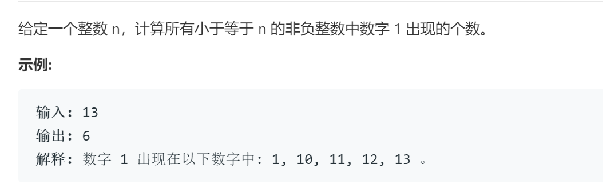

# 233数字1的个数

## 题目

## 代码

    class Solution:
        def countDigitOne(self, n: int) -> int:
            '''
                总结规律
                分别计算在各个位上的1的个数
                如数为123x456计算千位x为1的个数，则有如下规律
                若x==0  1的个数为123*1000
                若x==1  1的个数为123*1000 + 456 + 1
                若x>=1  1的个数为123*1000 + 1000
            '''
            if n <= 0: return 0
            a = 1 # 标记数位
            res = 0
            while True:
                tmp = (n%(10**a))//(10 ** (a-1) )#表示当前位置的数字
                if  tmp == 0:
                    res += (n//10**a)*(10 ** (a-1))
                elif tmp == 1:
                    res +=  (n//10**a)*(10 ** (a-1)) + n%(10**(a-1)) + 1
                else:
                    res += (n//10**a)*(10 ** (a-1)) + 10**(a-1)
                if n//(10**a)==0: return res
                a+=1
