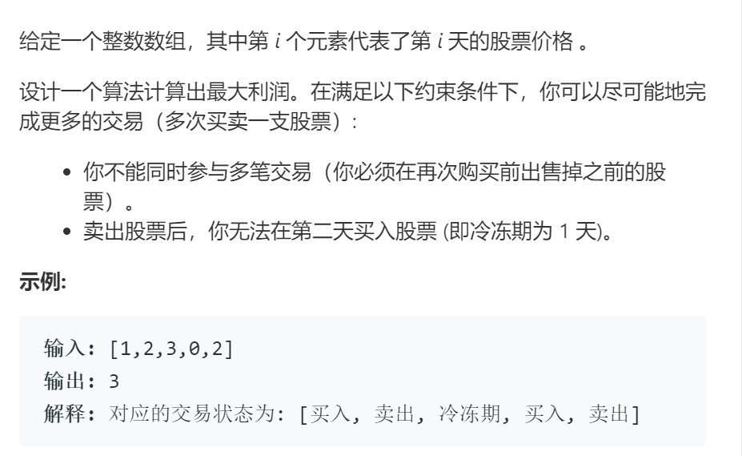

# 309最佳买卖股票时机含冷冻期

## 题目

## 代码

    class Solution:
        def maxProfit(self, prices: List[int]) -> int:
            '''
                标记当前股票的可交易状态
                0 表示未有股票
                1 表示持有股票
                
                动态规划，遍历所有状态，择优选择
                子问题：d[i][j] 表示第i天交易状态为j时的最大利润
                初始化：d[0]表示第0天即交易尚未开始
                    d[0][1] 不存在这种状况置为-(1<<30),此处不可为-1，由于第一次买入时可能出现利润为负的情况，-1不可表示不可用;
                    d[0][0] 表示最初的情况还未开始交易，利润为0;
                状态转移方程：
                    d[i][0] 若当日未持有股票，有两种可能：
                        1. 前一天未持有且未买入
                        2. 前一天持有本日卖出
                    d[i][1] 若当日持有股票，有两种可能：
                        1. 前一日持有未卖出
                        2. 两日前持有卖出，昨日为冷冻期，今日买入

                另由于每天的状态只与前一天的两个状态和两天前的一个状态有关，并不需要记录整个表格
                可以采用数个变量存储部分状态的方式降低空间复杂度

                动态规划 ==> 状态 + 选择 
            '''

            n = len(prices)
            dp_i_0, dp_i_1 = 0, -(1<<30) # 第0天的初始状态
            dp_pre_0 = 0 # 两天前未持有股票
            for i in range(n):
                tmp = dp_i_0
                dp_i_0 = max(dp_i_0, dp_i_1+prices[i])
                dp_i_1 = max(dp_i_1, dp_pre_0 - prices[i])
                dp_pre_0 = tmp
            return dp_i_0
