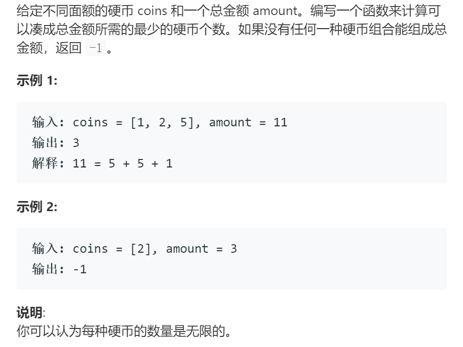

# 322零钱兑换

## 题目

## 思路

DP

子问题：d[i]表示coins中的硬币，组成金额i需要的最少枚数

初始化：d[0]表示目标金额为0元，初始化为0，其余位置初始化为一个极大值1<<30

状态转移方程:d[i] = min(d[i], d[i - coins[j]]+1)

## 代码-迭代版

    class Solution:
        def coinChange(self, coins: List[int], amount: int) -> int:
            n = len(coins)
            d = [ 1<<30 for i in range(amount+1)]
            d[0] = 0
            for i in range(1, amount+1):
                for j in range(len(coins)):
                    if(i >= coins[j]):
                        d[i] = min(d[i], d[i - coins[j]]+1)
            return d[amount] if d[amount]!= 1<<30 else -1

## 代码-递归版

    会超时

    class Solution:
        def coinChange(self, coins: List[int], amount: int) -> int:
            self.coins = coins
            self.d = [ -1 for i in range(amount+1)]
            self.d[0] = 0
            self.dp(amount)
            return self.d[amount] if self.d[amount]!= 1<<30 else -1

        def dp(self, s):
            if self.d[s] != -1:
                return self.d[s]
            self.d[s] = 1<<30
            for i in range(len(self.coins)):
                if(s>=self.coins[i]):
                    self.d[s] = min(self.d[s], self.dp(s-self.coins[i])+1)
            return self.d[s]
