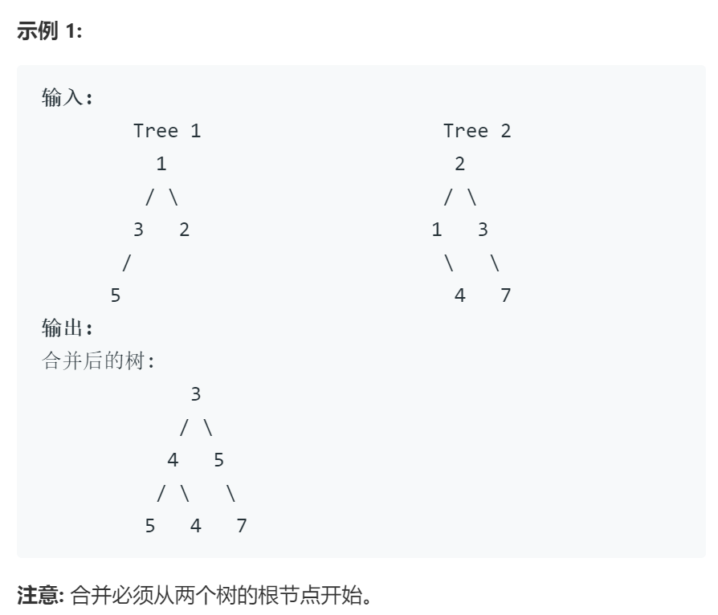

# 617 合并二叉树

## 题目

给定两个二叉树，想象当你将它们中的一个覆盖到另一个上时，两个二叉树的一些节点便会重叠。  

你需要将他们合并为一个新的二叉树。合并的规则是如果两个节点重叠，那么将他们的值相加作为节点合并后的新值，否则不为 NULL 的节点将直接作为新二叉树的节点。  

## 思路

以tree1为基础，同步的先序遍历两棵树，进行val加操作或节点插入操作

## 代码

    /**
    * Definition for a binary tree node.
    * struct TreeNode {
    *     int val;
    *     TreeNode *left;
    *     TreeNode *right;
    *     TreeNode(int x) : val(x), left(NULL), right(NULL) {}
    * };
    */
    class Solution {
    public:
        TreeNode* mergeTrees(TreeNode* t1, TreeNode* t2) {
        // 以tree1为基础，同步的先序遍历两棵树，进行val加操作或节点插入操作
        if( t1 == NULL || t2 == NULL) return t1 ? t1:t2; // 处理特殊情况，一树为空
        TreeNode* t = t1; // t指向t1做为最后的返回值
        TreeNode* p = t1; // p用作记录上一级节点，用于插入 
        int flag = 0; // 设置flag标记当前访问的是左子树还是右子树，0为左，右为1
        stack<TreeNode*> s1,s2,sp; // 利用栈完成迭代版的先序遍历,sp用作记录父节点p
        s1.push(t1);
        s2.push(t2);
        sp.push(NULL);
        while(!s2.empty() && !s1.empty()){
            t1 = s1.top(); s1.pop();
            t2 = s2.top(); s2.pop();
            p = sp.top();  sp.pop();
            flag = 1;
            /* 对不同的情况分别处理，t1，t2均有对应子树则相加
            * t1有对应子树t2没有，则跳过本轮循环
            * t2有对应子树t1没有，则根据p插入在相应位置
            */
            while(NULL!= t2 || NULL!=t1){
                if(NULL!=t1 && NULL!=t2) t1->val+=t2->val;
                else if(NULL!=t1) break;
                else if(0 == flag) {p->left = t2; break;}
                else if(1 == flag) {p->right = t2; break;}
                if(NULL!=t1 && NULL!=t1->right) s1.push(t1->right); else s1.push(NULL);
                if(NULL!=t2 && NULL!=t2->right) s2.push(t2->right); else s2.push(NULL);
                flag = 0;
                p = t1; sp.push(p);
                t1 = t1->left;
                t2 = t2->left;
            }
        }
        return t;
        }
    };

## 时间复杂度
与二叉树的先序遍历时间复杂度相同O(n)
用了三个栈和几个变量空间复杂度最坏情况O(n)

## 更优更精简的代码
    class Solution {
    public:
        TreeNode* mergeTrees(TreeNode* t1, TreeNode* t2) {
            if(t2==NULL){
                return t1;
            }
            if(t1==NULL){
                return t2;
            }
            t1->val=t1->val+t2->val;
            t1->left=mergeTrees(t1->left,t2->left);
            t1->right=mergeTrees(t1->right,t2->right);
            return t1;
            
        }
    };
直接递归