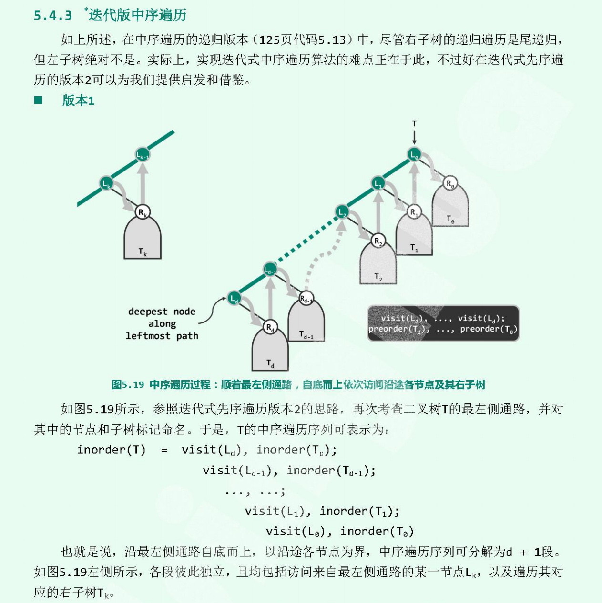

# 94二叉树的中序遍历

## 题目

中序遍历二叉树

## 思路

邓俊辉《数据结构》

## 代码

    /**
    * Definition for a binary tree node.
    * struct TreeNode {
    *     int val;
    *     TreeNode *left;
    *     TreeNode *right;
    *     TreeNode(int x) : val(x), left(NULL), right(NULL) {}
    * };
    */
    class Solution {
        stack<TreeNode*> s;
    public:
        void goAlongLeft(TreeNode* root) // 沿着当前节点一直向左前进
        {
            while(root) { s.push(root); root = root->left;}
        }

        vector<int> inorderTraversal(TreeNode* root) {
            vector<int> res;
            while(true)
            {
                goAlongLeft(root);
                if(s.empty()) break;
                res.push_back(s.top()->val);
                root = s.top()->right;
                s.pop();
            }
            return res;
        }
    };
