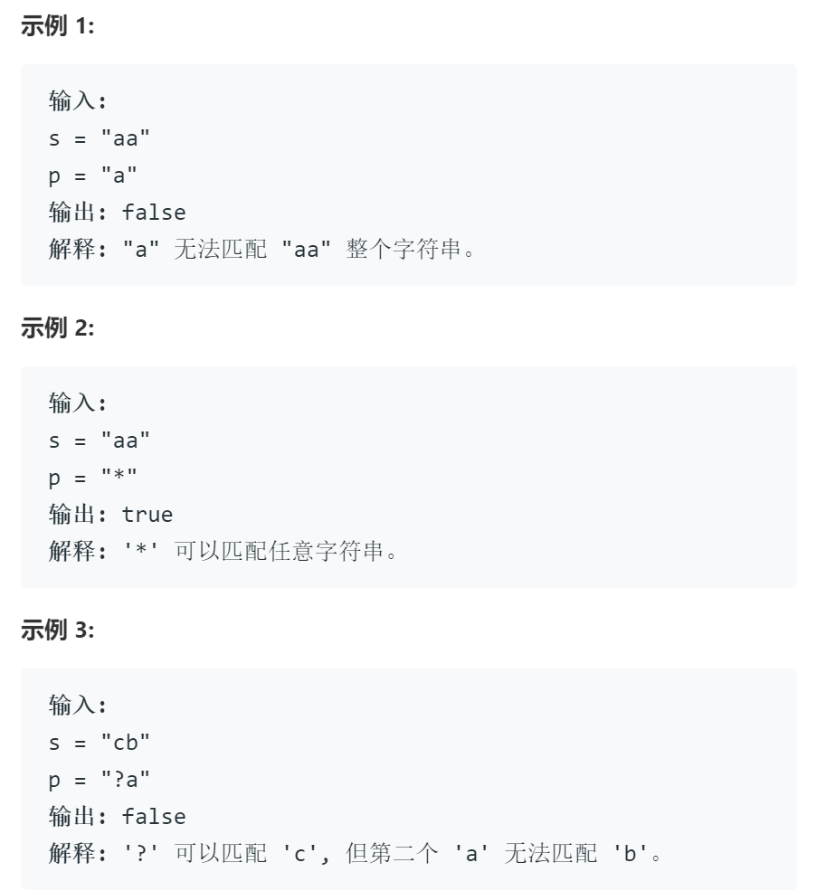

# 44通配符

## 题目

给定一个字符串 (s) 和一个字符模式 (p) ，实现一个支持 '?' 和 '*' 的通配符匹配。

'?' 可以匹配任何单个字符。
'*' 可以匹配任意字符串（包括空字符串）。
两个字符串完全匹配才算匹配成功。

说明:

s 可能为空，且只包含从 a-z 的小写字母。
p 可能为空，且只包含从 a-z 的小写字母，以及字符 ? 和 *。

## 思路

动态规划

大致想法和错误思路一致，之前错误的思路（附在正确代码后）两点致命的错误：

1. 边界的处理方式，保存已经得到的子问题解得矩阵应当比问题大一圈，否则越界的问题较难处理
2. 状态转移方程错误，会漏掉部分特殊情况，若单独对这些情况进行处理，会很蠢

若模式串p可以与串s匹配，那么模式串的任一前缀必然也可以与s的某一个前缀匹配

在这类问题中从前缀匹配的角度理解比起从后缀匹配的角度理解更方便，结合边界的处理，d矩阵会多出一行与一列，从前缀角度理解，这一行一列放在最前，不仅可以处理越界问题，同时也可代表某一字符串是空串的情况

状态转移方程如下：

1. if(s[i] == p[j] || p[j] == '?') d[i][j] = d[i - 1][j - 1];
2. if(p[j] == '*')  d[i][j] = d[i][j - 1] || dp[i - 1][j]

初始化：

1. d[0][0] 表示两个空串比较 其值为 true
2. d[0][j] 表示s为空，p不为空情形，只有当p均为*时，才可匹配成功
3. d[i][0] 表示p为空，s不为空，必然为false

## 代码

我现在实在不想看见c++了...

    class Solution:
        def isMatch(self, s: str, p: str) -> bool:
            m = len(s)
            n = len(p)
            d = [[False for n in range(n+1)] for m in range(m+1)]

            # 初始化
            d[0][0] = True
            for i in range(1, n+1):
                if  d[0][i - 1] and p[i-1]=='*':
                    d[0][i] = True

            for i in range(1, m+1):
                for j in range(1, n+1):
                    if s[i-1] == p[j-1] or p[j-1] == '?':
                        d[i][j] = d[i-1][j-1]
                    elif p[j-1] == '*':
                        d[i][j] = d[i][j - 1] | d[i - 1][j]
            return d[m][n]

## 错误思路

若模式串p可以与串s匹配，那么模式串的任一后缀必然也可以与s的某一个后缀匹配，因此在考虑上述问题时，从两个串的末尾开始考虑。

另一方面，由于通配符*的存在，匹配的方式可能不唯一；当以某种错误的方式匹配了通配符时，在发现错误时，需要及时的纠正，进行回溯，任意一种匹配方式匹配成功时，都要返回true。

结合动态规划的思想可以做出上表，从右下角开始，按照一定规则向左上角填表，若最终左上角为1，则说明可以成功匹配。

记表为d，d[i][j]为第i行第j列，填表规则可总结如下：

1. 若p[j]为普通字母，则当右斜下方为1，且p[j]==s[i]时，置1
2. 若p[j]为通配符 \? 时，则当右斜下方为1，置1
3. 若p[j]为通配符 \* 时，则当右斜下方、下方、右方任一方向为1，置1

最后一列与最后一行，作为初始条件需做单独处理：

1. 若为普通字符，匹配成功则如图所示，一格为1，同列同行置0
2. 若为通配符 \? ，同上
3. 若为通配符 \* ，同上

从右下角按行填表，行内从右到左

## 错误代码

    class Solution {
    public:
        bool isMatch(string s, string p) {
            int i = s.length() - 1; int j = p.length() - 1;
            vector<vector<bool>> d(s.length(), vector<bool>(p.length()));
            { // 对特殊情况进行处理
            /**
            * 均为空，成功
            * p空s不空，失败
            * s空p不同，检查p是否均为通配符
            **/
                if(i==-1 && j==-1) return true;
                else if(i!=-1 && j==-1) return false;
                else if(i==-1 && j!=-1) { for(int k = j; j>=0; j--){ if(p[j]!='*') return false; else return true;} }
            }
            { // 对边界进行处理
                if(p[j]=='*' || p[j]==s[i] || p[j]=='?') d[i][j] = true;
                else return false;
            }
            {
                for(i = s.length() - 1;i>=0;i--){
                    for(j = p.length() - 1;j>=0;j--){
                        if(i == s.length()-1 && j == p.length()-1) continue;
                        if(p[j]=='*' )
                        {
                            
                            if(i+1<s.length() && j+1<s.length() && d[i+1][j+1]) d[i][j] = true;
                            if(i+1<s.length() && d[i+1][j]) d[i][j] = true;
                            if(j+1<s.length() && d[i][j+1]) d[i][j] = true;
                        // if(p[j]=='*' && ((j+1<s.length() && d[i][j+1]) || (i+1<s.length() && d[i+1][j]) || (i+1<s.length() && j+1<s.length() && d[i+1][j+1]))) {d[i][j] = true;cout<<1;}
                        }
                        else if(i+1<s.length() && j+1<p.length() && p[j]=='?'&& d[i+1][j+1]) {d[i][j] = true;}
                        else if(i+1<s.length() && j+1<p.length() && p[j]==s[i] && d[i+1][j+1]) {d[i][j] = true;}
                        cout<<"i   "<<i<<"    j    "<<j<<endl;
                    }
                }
            }
            return d[0][0];
        }
    };

## 未完成

字符串匹配+栈，缺少回溯机制通配符*暂无法处理

    class Solution {
    public:
        bool isMatch(string s, string p) {
            bool res = true;
            int i = s.length()-1; // i,j分别指向s，p的尾部，作为栈顶指针
            int j = p.length()-1;
            cout<<i<<"   "<<j<<endl;

            while(0<=j){ 
                /** 处理"?"的情况 **/
                    if(p[j]=='?') { i--; j--; } // 若为?则统配任意一个字符，两个栈栈顶同时出栈
                /** 处理"*"的情况 **/
                    else if(p[j]=='*')
                    {
                        while(j>=0){
                            if(p[j-1]=='*') { j--;} // 若有连续多个通配符，则作用与一个通配符相同，通配符出栈，栈顶为下一个通配符*
                            else if(i>0 && p[j-1]!=s[i]) i--; // 通配字符串，s栈不断出栈
                            else if(j==0) return true;
                            else break; // 通配结束
                        }
                        j--; // 通配符出栈
                    }
                /** 处理常规的情况 **/
                    else if(p[j] != s[i]) return false; // 在没有通配符的情况下，失配必定整体不匹配
                    else { i--; j--;} // 最基本的情况，字符匹配，两个栈同时出栈即可
            }
            cout<<i<<"   "<<j<<endl;
            if(i == -1) return true; // 两个栈均为空，则匹配成功
            return false;
        }
    };
