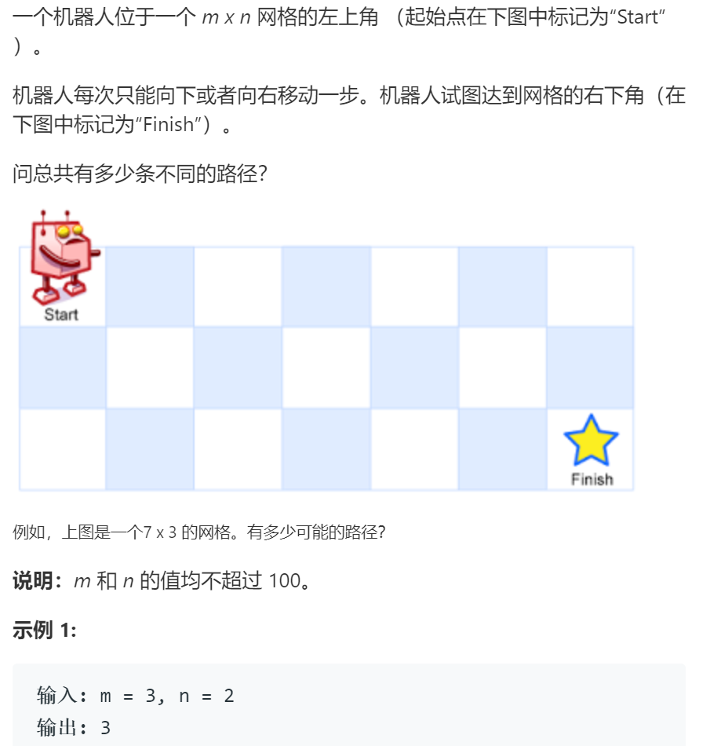
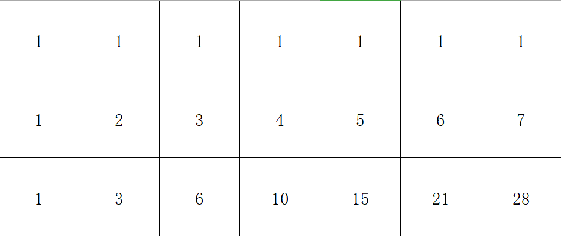

# 62不同路径

## 题目

## 思路

动态规划

子问题：定义d[i][j]为从起点(0,0)开始终点为(i,j)的可能路线数量

边界条件：d[0][j],d[i][0]，分别表示终点在起点同一列和同一行的情况，由于此时只有一条直线可以走，置为1

状态转移方程：d[i][j] = d[i-1][j]+d[i][j-1]，状态转移方程可通过如下图的过程推出

## 代码

    class Solution:
        def uniquePaths(self, m: int, n: int) -> int:
            d = [[0 for i in range(n)] for j in range(m)]

            # 初始化
            for i in range(m):
                d[i][0] = 1

            for j in range(n):
                d[0][j] = 1

            
            # 循环
            for i in range(1, m):
                for j in range(1,n):
                    d[i][j] = d[i-1][j]+d[i][j-1]
            
            return d[m-1][n-1]

## 复杂度

空间复杂度O(n*m)

时间复杂度，两层循环O(n*m)
