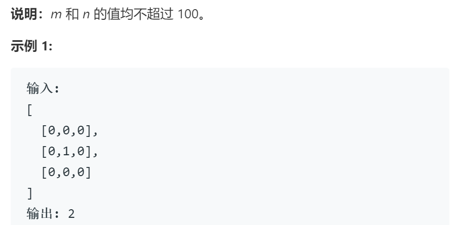
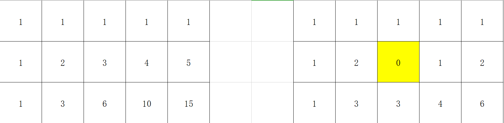

# 63不同路径2

## 题目

## 思路

与62不同路径不同的是加入了障碍，这使得边界条件和状态转移方程都会发生变化

子问题：定义d[i][j]为从起点(0,0)开始终点为(i,j)的可能路线数量

边界条件：d[0][j],d[i][0]，分别表示终点在起点同一列和同一行的情况，此时若起点与终点间存在障碍物则为0，否则为1

状态转移方程：d[i][j] = d[i-1][j]+d[i][j-1] if obstacleGrid[i][j]==0 else 0，障碍物置0即可 ，状态转移方程可通过如下图的过程推出

## 代码

    class Solution:
        def uniquePathsWithObstacles(self, obstacleGrid: List[List[int]]) -> int:
            n,m = len(obstacleGrid[0]),len(obstacleGrid)
            d = [[0 for i in range(n)] for j in range(m)]

            # 初始化
            if obstacleGrid[0][0]==0:
                d[0][0]=1

            for i in range(1,m):
                if d[i-1][0]==1 and obstacleGrid[i][0]==0:
                    d[i][0] = 1

            for j in range(1,n):
                if d[0][j-1]==1 and obstacleGrid[0][j]==0:
                    d[0][j] = 1

            
            # 循环
            for i in range(1, m):
                for j in range(1,n):                    
                    d[i][j] = d[i-1][j]+d[i][j-1] if obstacleGrid[i][j]==0 else 0
            
            return d[m-1][n-1]
