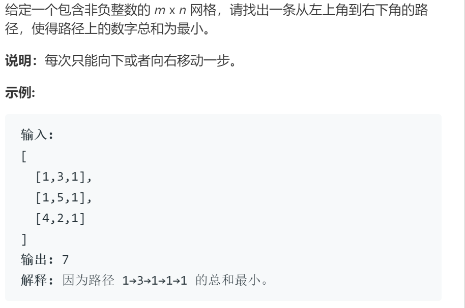

# 64最小路径和

## 题目

## 思路

记从网格第i行第j列出发到达右下角的最小数字总和为**d[i][j]**

由于每次只能向下或者向右移动，状态转移返程为
> d[i][j] = max{ d[i+1][j] + grid[i][j], d[i][j+1] + grid[i][j]}

## 代码_记忆化搜索

使用二维向量d来记录每个节点的最短路径，初始化为-1，表示未计算过。当不为-1时，说明已经计算过，可以直接跳过，不用再重复计算。

另外的，为控制边界条件，矩阵d比给定矩阵grid大一圈，将多出边界设置为无穷大。（我觉得这样控制边界条件有点捞，但没想到其他的）

    # define INF 0x3f3f3f3f;

    class Solution {
    public:
        vector<vector<int>> d; vector<vector<int>> grid; int res;
        int minPathSum(vector<vector<int>>& grid) {
        this->d = vector<vector<int>> (grid.size()+1, vector<int>(grid[0].size()+1, -1)); // 初始化数组d，由于为非负网格，初始化为数1，表示尚未计算
        this->grid = grid;
        return dp(0, 0);
        }

        int dp(int i, int j){
            int& ans = d[i][j]; // 使用一个引用便于叙述
            if(ans!=-1) return ans; // 当不为-1，表示计算过了，不必重复计算
            if(i >= d.size()-1|| j >= d[0].size()-1) { ans = INF; return ans; } // 控制边界
            ans = (i== d.size()-2 && j==d[0].size()-2) ? grid[i][j] : min(grid[i][j] + dp(i+1, j), grid[i][j] + dp(i,j+1) ); // 取向下方和向右方较小的
            return ans;
        }
    };

## 代码_递归

将上述代码中
> if(ans!=-1) return ans;

删除

算法即变为了纯递归，时间大幅增加，超出时间限制

## 代码_递推

同样使用矩阵d记录已经计算过的，从下向上递推，保证在计算d[i][j]时，d[i+1][j]与d[i][j+1]已经被计算出

    # define INF 0x3f3f3f3f;

    class Solution {
    public:
        int minPathSum(vector<vector<int>>& grid) {
        vector<vector<int>> d(grid.size()+1, vector<int>(grid[0].size()+1)); // 初始化数组d
        
        int i,j;
        { // 为控制边界，首先进行初始化，将额外的行列初始化为INF,将终点对应的d直接初始化
            for(i = grid.size(),j=0;j <= grid[0].size();j++) d[i][j]=INF;
            for(j = grid[0].size(),i=0;i <= grid.size();i++) d[i][j]=INF;
            // d[grid.size()-1][grid[0].size()-1] = grid[grid.size()-1][grid[0].size()-1];
        }
        { // 递推计算矩阵d, 按照从下到上按行递归，行内从右到左的顺序，能够有效利用缓存
            for(i = grid.size()-1; i>=0; i--){
                for(j = grid[0].size()-1; j>=0; j--){
                    d[i][j] = (i== d.size()-2 && j==d[0].size()-2) ? grid[i][j] : min(grid[i][j] + d[i + 1][j], grid[i][j] + d[i][j+1] ); 
                }
            }

        }
        return d[0][0];
        }
    };

这里存在一个问题，这个三目运算符的判断，实际上是为了给终点位置的d矩阵赋值，实际上可以直接赋值，但如果那样，代码写不规整，导致这个被反复调用浪费时间。求解
> d[i][j] = (i== d.size()-2 && j==d[0].size()-2) ? grid[i][j] : min(grid[i][j] + d[i + 1][j], grid[i][j] + d[i][j+1] );

## 复杂度

空间复杂度，都使用了额外的矩阵d来保存计算结果，同时递归的版本还需要额外的空间

记忆化搜索与递归：O(m*n + d) 其中d为从起点到终点可能的最长路径，这也是递归的最大深度

递推O(m*n)

---

时间复杂度

不用任何技巧的纯递归O(2^N)

记忆化搜索与递推 O(m*n) 即与矩阵中每个位置仅计算一次，与矩阵规模同
