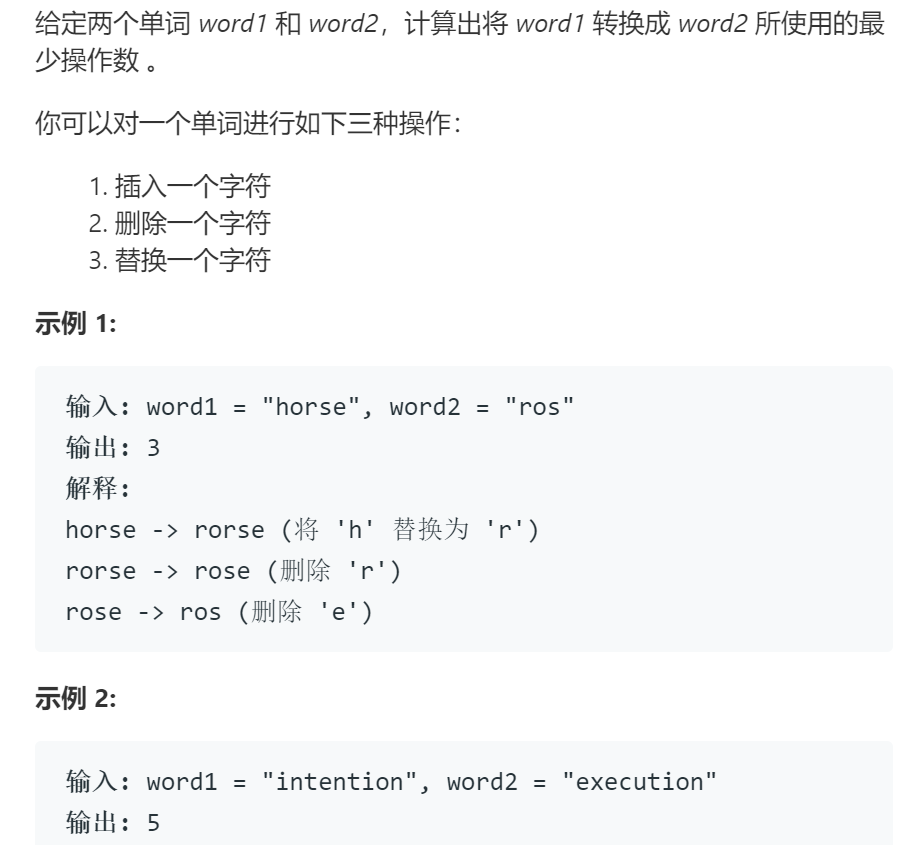

# 72编辑距离

## 题目

## 思路

子问题：定义d[i][j]为word1前j个字符和word2前i个字符的最短编辑距离

边界条件：字符串问题，考虑空串的情况，创建矩阵d时应当额外多出一行一列，表示其一字符串为空的情况  
具体初始化如下：
d[0][0]初始化为0，表示空串与空串
d[0][j]初始化为j，此时word2为空，word1删除j个字符后一致
d[i][0]初始化为j，此时word1为空，word2添加i个字符后一致

状态转移方程：if(word1[j-1]==word2[i-1]) d[i][j] = d[i-1][j-1];
             else d[i][j] = 1 + min(d[i-1][j],d[i][j-1], d[i-1][j-1]);
即若当前两个字符相等，则d[i][j]等于左上角的，否则取上方(增加)或者左侧(删除)或者左上角(替换)较小的数再加1

图片中最后一行第4个写错了，应当为2

## 代码

    class Solution {
    public:
        int minDistance(string word1, string word2) {
            int m = word2.length();
            int n = word1.length();
            int i,j;

            vector<vector<int>> d(m+1, vector<int>(n+1));

            // 初始化
            d[0][0] = 0;
            for(i=1; i<=m; i++) {d[i][0] = i;}
            for(j=1; j<=n; j++) {d[0][j] = j;}
            
            // 循环
            for(i=1; i<=m; i++){
                for(j=1; j<=n; j++){
                    if(word1[j-1]==word2[i-1]) d[i][j] = d[i-1][j-1];
                    else 
                    {   int mind = min(d[i-1][j],d[i][j-1]);
                        mind = min(d[i-1][j-1],mind);
                        d[i][j] = 1 + mind;
                    }
                }
            }
            return d[m][n];
        }
    };
