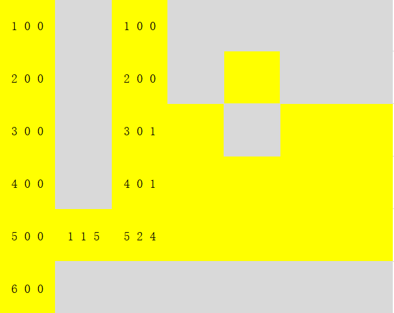

# 85最大矩形

## 题目

## 挣扎了一整天之后

在动归专题组里找到的这道题，只想熟悉DP，一直以试图找到DP的明显特征，但是经过多次挣扎，这道题并不是传统意义上的动归。各个子问题之间解之间的关系其实很弱，memory也并没有发挥什么大的作用，官方以DP为名字给出的解，实际上更像是优化版的搜索

在做题之前就明确的把自己困在某个算法框架里是件很蠢的事情

## 思路1

将题目可以抽象理解为做过的题目，本题与84题柱状图中的最大矩形类似，只需每行调用一遍该算法即可得到答案

## 思路2

## 代码

    class Solution:

        def maximalRectangle(self, matrix: List[List[str]]) -> int:
            if not matrix: return 0

            m = len(matrix)
            n = len(matrix[0])

            left = [0] * n # initialize left as the leftmost boundary possible
            right = [n] * n # initialize right as the rightmost boundary possible
            height = [0] * n

            maxarea = 0

            for i in range(m):

                cur_left, cur_right = 0, n
                # update height
                for j in range(n):
                    if matrix[i][j] == '1': height[j] += 1
                    else: height[j] = 0
                # update left
                for j in range(n):
                    if matrix[i][j] == '1': left[j] = max(left[j], cur_left)
                    else:
                        left[j] = 0
                        cur_left = j + 1
                # update right
                for j in range(n-1, -1, -1):
                    if matrix[i][j] == '1': right[j] = min(right[j], cur_right)
                    else:
                        right[j] = n
                        cur_right = j
                # update the area
                for j in range(n):
                    maxarea = max(maxarea, height[j] * (right[j] - left[j]))

            return maxarea

## 错误思路

动态规划

首先我们需要将问题进行一定的转化，对于输入矩阵中的任何一个位置（为1的位置），我们可以按照如下方式确定一个包含它的最大矩阵

1. 从该位置向上，直到遇到0，确认矩形的高，记为tall
2. 从该上一步到的最高位置不断向左，确认左边的长left
3. 从1到的最高位置不断向右，确认右边的长right
4. 矩形面积为tall*(left + right +1)

子问题：定义d[i][j]记录matrix对应位置的一个三元组(tall, left right)，具体意义如下

- tall：矩形的高
- left：向左走的步数
- right：向右走的步数

边界条件：略

状态转移方程：**(d矩阵元素的比较均为计算出的矩形面积的比较)**

1. 若该位置为0 **d[i][j] = max(d[i-1][j],d[i][j-1])**
2. 若该位置为1：

## 错误代码

    # define INF 0x3f3f3f3f

    class Solution {
    public:
        vector<vector<char>> matrix;
        struct tlr
        { // 表示高，左步数，右步数的三元组
            int tall=0;
            int left=0;
            int right=0;
        };
        
        tlr maxTLR(tlr t1, tlr t2)
        { // 用于比较三元组大小
            return t1.tall*(t1.left+t1.right+1) > t2.tall*(t2.left+t2.right+1) ? t1 : t2;
        }

        int probeRight(int i, int j)
        {   
            int right = 0;
            while(++j < matrix[0].size())
            {   // cout<<j<<endl; 
                if(matrix[i][j] == '0') break;
                right++;
            }
            // cout<<right<<endl;
            return right;
        }
    int probeleft(int i, int j)
        {   
            int left = 0;
            while(--j > -1)
            {   // cout<<j<<endl; 

                if(matrix[i][j] == '0') break;
                left++;
            }
            // cout<<right<<endl;
            return left;
        }

        int maximalRectangle(vector<vector<char>>& matrix) {
            int m = matrix.size(), n = matrix[0].size();
            vector<int> oldright(n, INF);  // 用于记录某一列当前最小的right
            vector<int> oldleft(n, -1);  // 用于记录某一列当前最小的right

            int i,j;
            this-> matrix = matrix;
            tlr ans;
            vector<vector<tlr>> d(m, vector<tlr>(n));

            // 初始化
            if(matrix[0][0] == '1' ) d[0][0].tall=1;
            d[0][0].right = probeRight(0,0);
            ans = d[0][0];
            for(i=1; i<m; i++)
            {
                if(matrix[i][0] == '1')
                { 
                    d[i][0].tall = matrix[i-1][0] == '1' ? d[i-1][0].tall+1 : 1;
                    ans = maxTLR(ans, d[i][0]);
                }
            }
            for(j=1; j<n; j++) // 在初始化第一行同时，更新每一列的oldright和oldleft
            { 
                if(matrix[0][j] == '1')
                {
                    d[0][j].tall = 1;
                    d[0][j].left = matrix[0][j-1] == '1' ? d[0][j-1].left+1 : 0;
                    oldright[j] = probeRight(0,j);
                    oldleft[j] = d[0][j].left;
                    ans = maxTLR(ans, d[0][j]);
                }
            }

            // 循环
            for(i=1; i<m; i++)
            {
                for(j=1; j<n; j++)
                {
                    // 1. matrix[i][j]=0
                    if(matrix[i][j] == '0') 
                    {
                        oldright[j] = INF;
                        oldleft[j] = -1;
                    }
                    // 2. matrix[i][j]=1
                    else 
                    {
                        // 2.1 更新tall
                        d[i][j].tall = matrix[i-1][j] == '0' ? 1 : d[i-1][j].tall+1;
                        // 2.2 更新right
                        d[i][j].right = min(oldright[j], probeRight(i,j));
                        // 2.3 更新left
                        d[i][j].left = max(oldleft[j], probeleft(i,j));
                        cout<<i<<"  "<<j<<"  "<<d[i][j-1].left<<"  "<<d[i][j].left<<endl;

                        // cout<<d[i][j].tall<<"  "<<d[i][j].left<<"  "<<d[i][j].right<<endl; 
                        ans = maxTLR(ans, d[i][j]);
                    }
                }
            }
                                
            cout<<ans.tall<<"  "<<ans.left<<"  "<<ans.right<<endl;
            return ans.tall=='0' ? 0 : ans.tall*(ans.left+ans.right+1);
        }
    };

## 错误思路2

在某些情况，无法确定状态转移方程，只能通过一定程度的枚举进行确定，但这样一来算法等于优化的蛮力算法，且由于额外的空间开销，甚至属于较差的蛮力算法

---

动态规划

子问题：定义d[i][j]为前的i行j列的矩阵中最大的矩形面积

边界条件：
d[0][0]单独判断，若matrix[0][0]\==1，则为1，否则为0
d[i][0]表示仅存在一列时最大矩形的面积，初始化规则为
**if(matrix[i][0]\=="1") d[i][0] = maxtirx[i-1][0] ? d[i-1][0]+1:1;**
d[0][j]规则类似：**if(matrix[0][j]\=="1") d[0][j] = maxtirx[0][j-1] ? d[0][j-1]+1:1;**

状态转移方程：

以输入示例为例，图中黄色块为maxtirx中为1的位置，灰色快为0

将上图的三个矩阵分别记为d，d1，d2

d矩阵即是我们最后求得的最大矩形，为了能够得到状态转移方程需要借助d1和d2

其中d1为从上到下，只考虑竖直的一列的，最大矩形面积（以红色矩形标出示意）
d2为从左到右，只考虑水平一行的，最大矩形面积

通过两遍遍历，能够轻松得到d1和d2，在此基础上，d的状态转移方程如下

若maxtirx[i][j]=="0"，则该位置对整体最大矩形面积无贡献：**d[i][j] = max(d[i-1][j],d[i][j-1])**

若maxtirx[i][j]=="1"，则可分为四种情况：

1. 在maxtirx中该位置左侧为0，上方为1：**d[i][j] = max(d1[i][j], max(d[i-1][j],d[i][j-1])**
2. 在maxtirx中该位置左侧为1，上方为0：**d[i][j] = max(d2[i][j], max(d[i-1][j],d[i][j-1])**
3. 在maxtirx中该位置左侧为0，上方为0：**d[i][j] = max(d[i-1][j],d[i][j-1])**
4. 在maxtirx中该位置左侧为1，上方为1，此时可借助d1,d2分别确定新矩形的高和宽：
**GG了，确定不了，难受了**
