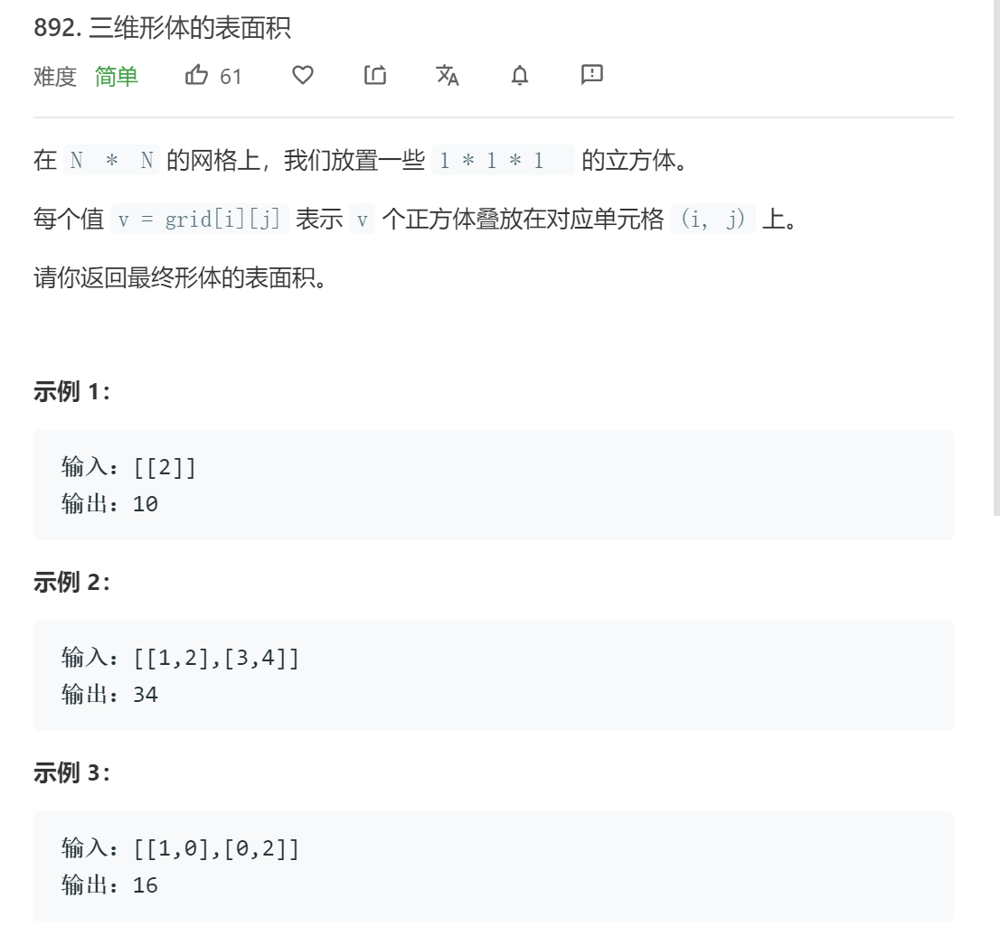

# 三维体的体积

## 题目

## 代码

    class Solution:
        def surfaceArea(self, grid: List[List[int]]) -> int:
            '''
                1. 计算网格中每处不考虑相邻方块遮挡时的表面积总和
                    即sum(g[i][j]*4+2)
                2. 计算相互遮挡面积
                    即每个位置检查上方和左侧被遮挡面积为2*min(grid[i][j], grid[i-1][j])+2*min(grid[i][j], grid[i][j-1])
                3. 1面积-2面积即可
            '''
            surfaceArea_1, surfaceArea_2 = 0, 0
            for i in range(len(grid)):
                for j in range(len(grid[0])):
                    surfaceArea_1 += 0 if grid[i][j]==0 else grid[i][j]*4 + 2
                    if j!=0: surfaceArea_2 += 2*min(grid[i][j], grid[i][j-1])
                    if i!=0: surfaceArea_2 += 2*min(grid[i][j], grid[i-1][j])
            return surfaceArea_1 - surfaceArea_2
