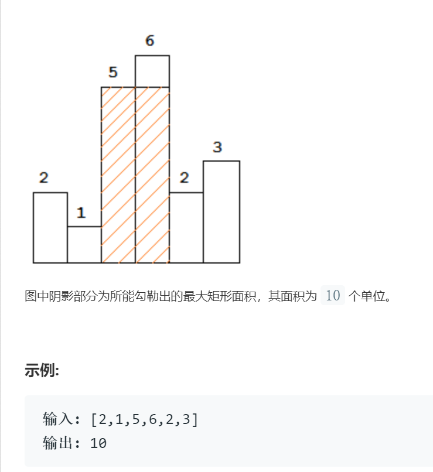

# 84柱状图中的最大矩形

## 题目

给定 n 个非负整数，用来表示柱状图中各个柱子的高度。每个柱子彼此相邻，且宽度为 1 。
求在该柱状图中，能够勾勒出来的矩形的最大面积  

## 思路

栈的经典应用，借助栈的存在，可以在一次遍历中得到答案

## 代码

    class Solution {
    public:
        int largestRectangleArea(vector<int>& heights) {
            // 初始化需要用到的遍历
            stack<int> s;  s.push(-1); // 辅助栈，用于存放各个矩形的序号,并且在最初压入-1作为哨兵
            int maxArea = 0; // 存储当前的最大面积
            int i = -1;  // 控制循环的变量
            int top; // 在数组遍历完后，需要同时用到栈的前两个数据，其中一个用top存储
            
            while(++i < heights.size()) // 遍历输入的每一个矩形
            {   /**
                * 对于每个矩形做如下处理:
                * 1. 若当前矩形的高度高于等于当前栈顶的那一块矩形，则入栈
                * 2. 若当前矩形的高度低于栈顶的那一块，则不断弹出栈顶元素，
                * 根据公式heights[s.top()] * (i - s.pop().top() - 1)计算面积，并更新maxArea
                * 直到栈顶矩形的高度小于等于当前矩形
                **/
                if(s.top()==-1 || heights[i] >= heights[s.top()]) s.push(i); 
                else
                {
                    while(s.top()!=-1 && heights[s.top()] > heights[i])
                    {   
                        top = s.top();
                        s.pop();
                        maxArea = max(heights[top] * (i-s.top()-1), maxArea);
                    }
                    s.push(i);
                }
            }
            // 3. 当heights数组遍历完时，同样出栈，按heights[s.top()] * (i - s.pop().top() - 1)计算
            while(s.top()!=-1)
            {
                top = s.top();
                s.pop();
                maxArea = max(heights[top] * (i-s.top()-1), maxArea);
            }
            return maxArea;
        }
    };

## 复杂度

时间复杂度：每个矩形的序号实际上只会入栈一次O(n)
空间复杂度:使用了额外的栈，最坏情况O(n)