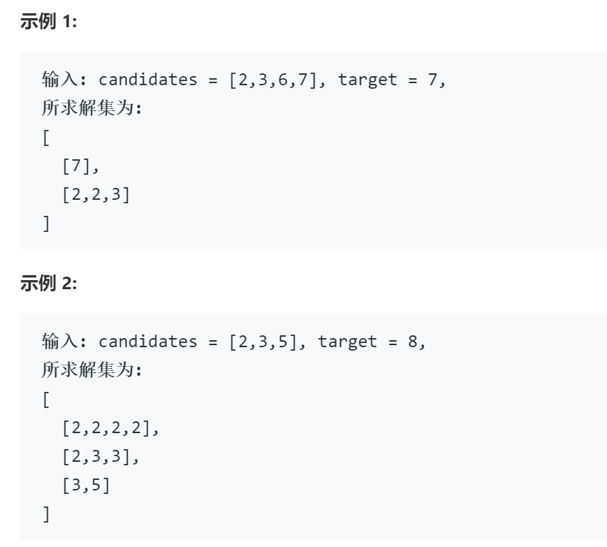

# 39组合总数

## 题目

给定一个无重复元素的数组 candidates 和一个目标数 target ，找出 candidates 中所有可以使数字和为 target 的组合。

candidates 中的数字可以无限制重复被选取。

说明：

所有数字（包括 target）都是正整数。
解集不能包含重复的组合。

## 思路

回溯  

对于回溯方法，典型的问题时八皇后问题，反复试探，若不满足条件，则回溯到上一步重新试探，通过与剪枝结合遍历整个解空间

在对回溯的理解上通常以画树状图作为前置，通过图来完成代码，并设置剪枝条件。试探的过程相当于找到合适的从根节点到叶节点的路径。因此也可以将回溯理解为DFS。

对于回溯类问题代码的写法，可以使用以下模板。

    result = []
    def backtrack(路径, 选择列表):
        if 满足结束条件:
            result.add(路径)
            return

    for 选择 in 选择列表:
        做选择
        backtrack(路径, 选择列表)
        撤销选择

## 代码

    class Solution {
    public:
        vector<vector<int>> combinationSum(vector<int>& candidates, int target) {
            vector<vector<int>> res; vector<int> path;
            sort(candidates.begin(), candidates.end());
            backtrack(candidates, 0, target, res, path);
            return res;
        }

        void backtrack(vector<int>& candidates, int index, int target, vector<vector<int>>& res, vector<int> path){
            // 此处的技巧，所求问题为多个数总和等于target
            // 在代码中反向考虑，从target中不断减去各个数字直到为0
            if(0==target) { res.push_back(path); return; } // 回溯停止的两种条件之一，target减到0，即为一个符合要求的解，加入解集
            if( 0>target ) return; // 回溯停止的两种条件之二，target为负，不符合条件，向前回溯
            // 此处的index和之前的sort起到了剪枝去重的作用，保证后选择的路径不会是之前已经考虑过的，即避免了集合相同，顺序不同
            for(int i=index; i < candidates.size(); i++){
                if(target < candidates[i]) break;
                path.push_back(candidates[i]);
                backtrack(candidates, i, target-candidates[i], res, path);
                path.pop_back();
            }
        }
    };

## 时间复杂度

最坏情况下该问题等同于幂集问题，时间复杂度O(2^n)  
递归问题中，空间复杂度于递归层数一致，假设最坏情况下，candidates中存在一个极小值，所求目标target极大，假设target恰好为该极小值的整数倍，那么理论上会递归无线层，空间复杂度理论上会无限大.......

## 代码（错误版本）

**错误原因**：思路零碎，回溯的条件设置有问题，没有整体架构，想到哪写到哪，总会出现漏解或多解的问题

    class Solution {
    public:
        vector<vector<int>> combinationSum(vector<int>& candidates, int target) {
            vector<int> tmp; vector<vector<int>> res; int index = 0; int sum = 0; int cindex=0;
            vector<int>::size_type ix=0;
            for(int sindex = 0;sindex < candidates.size();++sindex){
                cindex=sindex; index=sindex; sum=0; tmp.clear();
                cout<<candidates[index]<<endl;
                do{
                    ix = 0;
                    while(sum < target){
                        tmp.push_back(candidates[index]);
                        sum = accumulate(tmp.begin(), tmp.end(),0);
                    }
                    while(ix!=tmp.size()){
                            cout<<tmp[ix++]<<" ";
                    }//通过下标输出容器中的元素
                    cout<<sum<<endl;
                    if(target == sum) { 
                        res.push_back(tmp);
                        tmp.pop_back();
                        cindex++;
                        index = cindex;
                        sum = accumulate(tmp.begin(), tmp.end(),0);
                    }
                    else { tmp.pop_back(); ++index;
                    sum = accumulate(tmp.begin(), tmp.end(),0);
                    if(index==candidates.size()){
                        tmp.pop_back();
                        sum = accumulate(tmp.begin(), tmp.end(),0);
                        cindex++;
                        index = cindex;
                    }
                    }
                } while(cindex < candidates.size()); // 数组中所有数字被考虑后结束 
            }
        sort(res.begin(), res.end());
        res.erase(unique(res.begin(), res.end()), res.end());
        return res;
        }
    };
