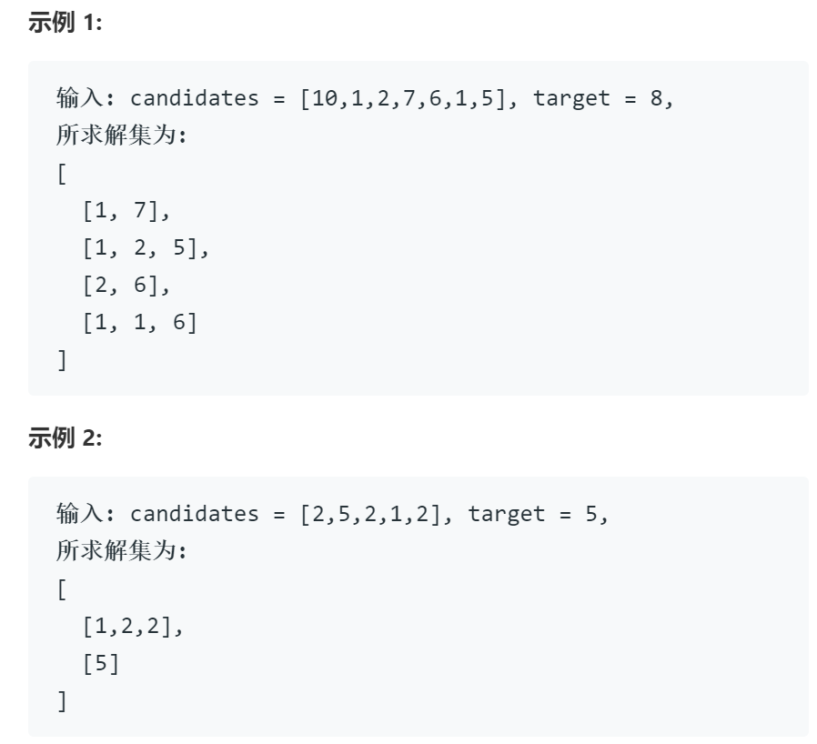

# 40组合总和2

## 题目

给定一个数组 candidates 和一个目标数 target ，找出 candidates 中所有可以使数字和为 target 的组合。

candidates 中的每个数字在每个组合中只能使用一次。

说明：

所有数字（包括目标数）都是正整数。
解集不能包含重复的组合。

## 思路

回溯

与39题相似，仅修改了数字可重复使用这一限制，简单修改即可

## 代码

    class Solution {
    public:
        vector<vector<int>> combinationSum2(vector<int>& candidates, int target) {
            vector<vector<int>> res; vector<int> path; int start = 0;
            std::sort(candidates.begin(), candidates.end()); // start变量和sort组合用于去重剪枝
            backtrack(0, res, candidates, path, target);
            // 本题中存在的一个问题，以[10,1,2,7,6,1,5],target为8为例，虽然可以有[1,1,6]这样的解，但是两个1组成的[1,7]为同一个解，因此存在去重的问题，可以使用set的特性完成，但会消耗大量时间和空间勉强通过
            // 观察其他答案，可以简单的在递归循环中设置  if(i > startpos && candidates[i] == candidates[i - 1])  continue;条件即可
            set<vector<int>> s (res.begin(), res.end());
            res.assign(s.begin(), s.end());
            return res;
        }

        void backtrack(int start, vector<vector<int>>& res, vector<int>& candidates, vector<int> path,int target){
            if( 0==target ) {res.push_back(path); return;} // 终止条件
            if( 0>target ) return;

            for(int i = start; i < candidates.size(); i++){
                path.push_back(candidates[i]); // 递归前选择
                backtrack(i+1, res, candidates, path, target - candidates[i]); // 开始回溯递归,这里第一个参数传入i+1而不是i避免重复使用一个数字
                path.pop_back(); // 递归后撤销选择
            }
        }
    };

## 复杂度

与39组合总数同
