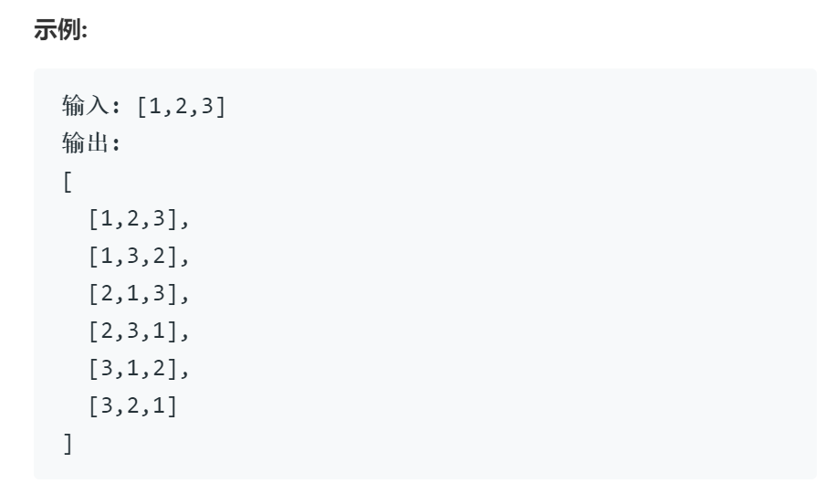

# 46全排列

## 题目

给定一个没有重复数字的序列，返回其所有可能的全排列。

## 思路

回溯

---
还是使用在39组合总数中提到的回溯模板，在这一题中参考了时间和空间利用最高的代码，对代码的组织做了改进。利用c++的面向对象，将递归时需要传递的一些参数设置为了类的成员变量，减少了递归函数栈中需要传递的参数以及占用的空间。

---

在这一问题中，回溯的三要素确定如下：

选择：nums中的任意一个数

限制条件：每个数只能用一次

结束条件：已选取的数等于nums总数，即为一个解可加入解集

---

1. 需要考虑的地方在如何保证每个数只使用一次，可以使用额外的数组作为flag，记录该数是否使用，但会产生额外的开销

2. 每次插入前遍历当前解，判断欲插入的数字是否已经存在

3. 在用几个小时肝完第一种方案之后，我发现了stl的find函数........可以直接判断是否存在

---
额外的，这一问题等同于求序列的全部栈混洗，在这一基础上递推可知对于括号匹配等类似问题都可以使用这种回溯模式解决。

## 代码

    class Solution {
    public:
        vector<vector<int>> res; vector<int> nums; // 反复使用的参数作为类的成员变量
        vector<int> tmp; stack<int> path; int index; vector<int> flag; // 使用了额外的一个栈和一个向量来进行是否重复的判断
        vector<vector<int>> permute(vector<int>& nums) {
            sort(nums.begin(), nums.end()); //为了避免重复使用数字的剪枝进行准备
            this->nums = nums;
            vector<int> tf(nums.size());
            this->flag = tf;
            backtrack();
            return res;
        }

        void backtrack(){
            if( path.size()==nums.size() ) { res.push_back(tmp); return;} // 满足条件，为一个排列，加入解集
            for( int i=0; i<nums.size(); i++){
                if( 1==flag[i] ) continue; // 避免重复使用数字
                { // 递归前选择
                    flag[i] = 1;  
                    path.push(i);
                    tmp.push_back(nums[i]);
                }
                backtrack();
                { // 递归后撤销选择
                    index = path.top(); path.pop();
                    flag[index] = 0;
                    tmp.pop_back();
                }

            }
        }

    };

## 复杂度

时间复杂度，全排列问题，首先确定最好的时间复杂度为O(n!)，就上述代码，nums中的每一个数字都会循环n轮，虽然其中部分轮次进入循环经判断后会立即退出，但仍记为一次基本操作，n为nums的长度，故时间复杂度为O(n^n)

空间复杂度，空间的消耗主要来自两个方面，一方面是为了去重使用的额外的向量和栈，他们的规模都与nums向量相同，为O(n)，另一方面就是递归需要的空间，取决于递归的深度，由于结束条件的限制，可知递归最多不超过nums的长度，也为O(n)，故空间复杂度为O(n)
