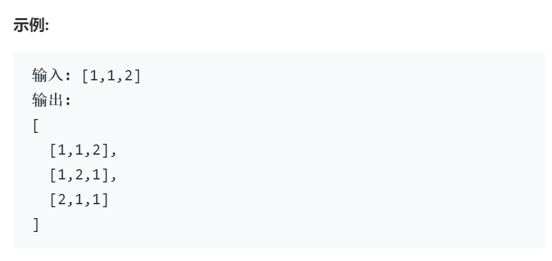
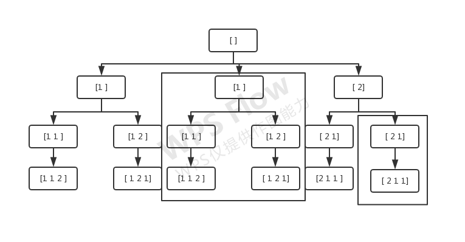
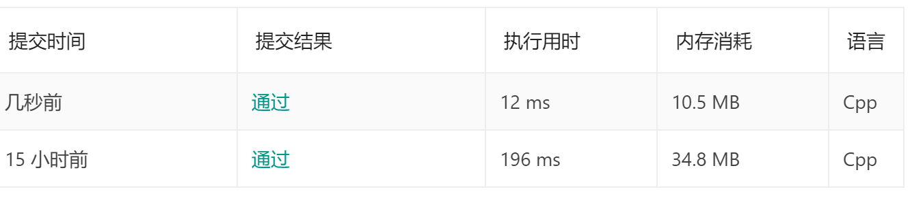

# 47全排列2

## 题目

给定一个可包含重复数字的序列，返回所有不重复的全排列。

## 思路 1

大致结构与46全排列基本相同，需要对重复数字产生的重复组合做出过滤，在46全排列的代码基础上，利用集合的特性去重即可，同样会出现时间空间消耗较大的情形

## 代码 1

        set<vector<int>> s(res.begin(), res.end());
        res.assign(s.begin(), s.end());

## 思路 2

为更便捷的进行剪枝的工作，首先需要将数组排序，使得相同的数字相邻在一起

以上述输入示例为例，将回溯时对应的树状图，可以观察到重复的部分为方框框住的内容。重复分支的起点均满足以下条件：

1. 起点与同层的上一个数相同
2. 该数字并不在当前解中

过滤掉上述满足上述条件的解即可

## 代码 2

新加一句剪枝的代码即可
> if( i>0 && nums[i]==nums[i-1] && flag[i-1]==0) continue;

        class Solution {
        public:
        vector<vector<int>> res; vector<int> nums; // 反复使用的参数作为类的成员变量
        vector<int> tmp; stack<int> path; int index; vector<int> flag; // 使用了额外的一个栈和一个向量来进行是否重复的判断
        vector<vector<int>> permuteUnique(vector<int>& nums) {
                sort(nums.begin(), nums.end()); //为了避免重复使用数字的剪枝进行准备
                this->nums = nums;
                vector<int> tf(nums.size());
                this->flag = tf;
                backtrack();
                return res;
        }

        void backtrack(){
                if( path.size()==nums.size() ) { res.push_back(tmp); return;} // 满足条件，为一个排列，加入解集
                for( int i=0; i<nums.size(); i++){
                if( 1==flag[i] ) continue;
                if( i>0 && nums[i]==nums[i-1] && flag[i-1]==0) continue;
                { // 递归前选择
                        flag[i] = 1;  
                        path.push(i);
                        tmp.push_back(nums[i]);
                }
                backtrack();
                { // 递归后撤销选择
                        index = path.top(); path.pop();
                        flag[index] = 0;
                        tmp.pop_back();
                }

                }
                
        }
        };

## 对比

第二种剪枝的方法表现出了明显的优越性。
