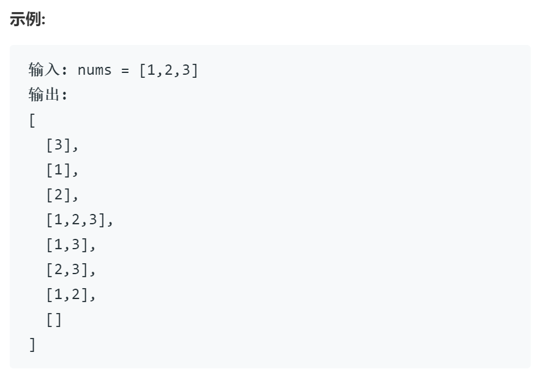
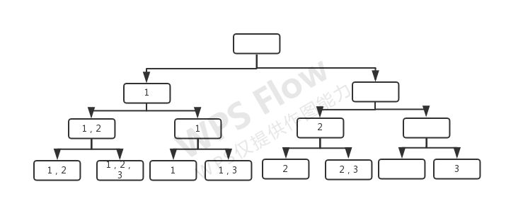

# 78 子集

## 题目

给定一组不含重复元素的整数数组 nums，返回该数组所有可能的子集（幂集）。

说明：解集不能包含重复的子集。

## 思路1

从前向后遍历，以res记录答案，初始时只有一个空集，每遇到一个新数值让当前res中的集合加上新的值再加入res中

思路较为简单，但由于语言特性，使用java和python时需要考虑深复制和浅复制的问题

## 代码1

    class Solution:
        def subsets(self, nums: List[int]) -> List[List[int]]:
            res = [[]]
            for e in nums:
            # 这里是问题的重点，必须使用切片的形式，这样才能达到深复制的效果，否则会因为共用内存出错
                for ee in res[:]:
                # 另外的问题，在python中append会直接在原变量的基础上原地修改，没有返回值
                    res.append(ee+[e])
            return res

## 时间复杂度1

在输入规模为n时，外层循环n次，内循次数以2倍的形式递增，共循环1+2+4+8+…+n=O(2^n),空间复杂度为res所用空间O(2^n)

## 思路2

回溯

回溯的各种要素确定如下：

选择：nums中的每个元素是否选择

限制条件：不可重复使用

结束条件：遍历完整个数组nums

画出回溯对于的树:

## 代码2

    class Solution {
    public:
        vector<vector<int>> res; vector<int> nums; vector<int> tmp;
        vector<vector<int>> subsets(vector<int>& nums) {
            this->nums = nums;
            backtrack(0);
            return res;
        }
        void backtrack(int index){
            // 其中index可以理解为对于树状图的深度index为3，即到达叶节点时得到一个解
            if( index == nums.size()) {index--; res.push_back(tmp); return; }
            for(int i = 0; i < 2;i++){
                { // 做出选择
                    if(i==0) tmp.push_back(nums[index]);             
                }
                backtrack(index+1);
                cout<<index<<endl;

                { // 撤销选择
                    if(i==0) tmp.pop_back(); 
                }
            }
            index--;
            

        }
    };

## 复杂度分析2

对于时间复杂度，即整个程序中循环的次数，对应在树状图中，每一层都会有两个循环，可知时间复杂度为O(2^n)

空间复杂度取决于递归的深度，递归最深与nums数组的长度相同，因此空间复杂度为O(n)