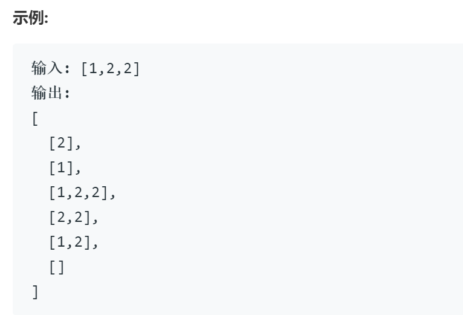
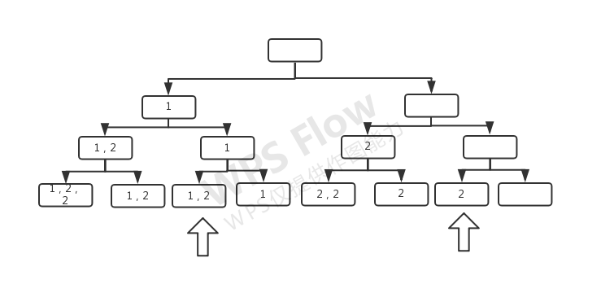

# 90子集2

## 题目

给定一个可能包含重复元素的整数数组 nums，返回该数组所有可能的子集（幂集）。

说明：解集不能包含重复的子集。

**以下思路均基于78子集的回溯方法**

## 思路1

类似去重问题显然可以利用集合特性完成

## 思路2

经分析进行剪枝

以输入示例为例画出回溯对应树状图:

其中箭头指向的叶节点为重复的节点，需要进行剪枝。

为便于剪枝，先对nums数组进行排序，保证重复的数字相邻

观察可知，被减掉的叶节点 满足以下条件，

1. 为重复数字
2. 叶节点为左孩子，即这一步所做选择为选取
3. 该叶节点的父亲为右孩子，即上一步所做选择为不选取

## 代码2

剪枝代码
> if(index>0 && nums[index]==nums[index-1] && i==0 && flag==0) continue;

    class Solution {
    public:
        vector<vector<int>> res; vector<int> nums; vector<int> tmp; int flag = 1; // 额外设置flag标记上一步是否选取
        vector<vector<int>> subsetsWithDup(vector<int>& nums) {
            sort(nums.begin(), nums.end()); // 排序
            this->nums = nums;
            backtrack(0);
            return res;
        }
        void backtrack(int index){
            if( index == nums.size()) {index--; res.push_back(tmp); return; }
            for(int i = 0; i < 2;i++){
                if(index>0 && nums[index]==nums[index-1] && i==0 && flag==0) continue; // 剪枝
                { // 做出选择
                    if(i==0) { tmp.push_back(nums[index]); flag=1; } else flag = 0; // 设置flag，上一步选取记为1，上一步不选取记为0
                }
                backtrack(index+1);
                cout<<index<<endl;

                { // 撤销选择
                    if(i==0) tmp.pop_back(); 
                }
            }
            index--;
            

        }
    };
