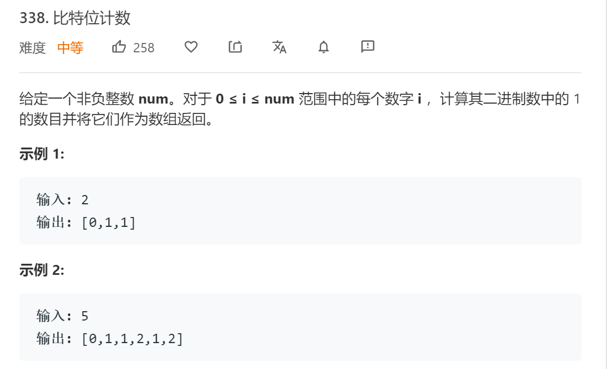

# 338比特位计数

## 题目

## 代码

    class Solution:
        def countBits(self, num: int) -> List[int]:
            '''
                对于任意整数根据其奇偶性可以发现以下规则：
                1. 奇数
                    其转化为二进制后，1的个数比小于它的那个偶数多1
                2. 偶数
                    其转化为二进制后，1 的个数一定和除以 2 之后的那个数一样多(二进制末位是0，右移后1的个数不变)
            '''
            ans = [0]
            if num == 0: return ans
            for i in range(1, num+1):
                if i&1 == 0:
                    ans.append(ans[i//2])
                else:
                    ans.append(ans[i-1]+1)
            return ans
