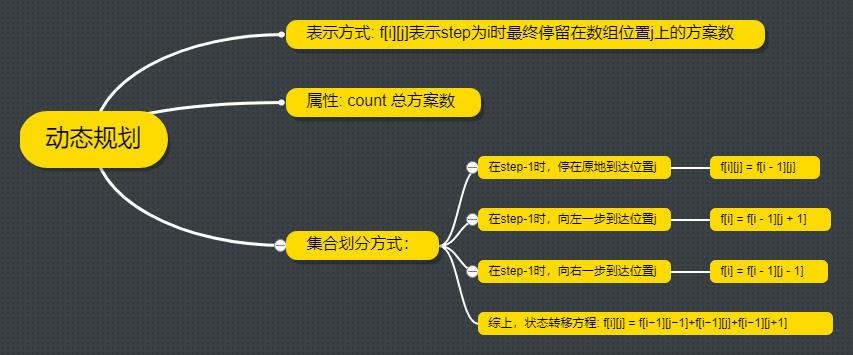

# 1269. 停在原地的方案数

## [题目](https://leetcode-cn.com/problems/number-of-ways-to-stay-in-the-same-place-after-some-steps/)

有一个长度为 arrLen 的数组，开始有一个指针在索引 0 处。

每一步操作中，你可以将指针向左或向右移动 1 步，或者停在原地（指针不能被移动到数组范围外）。

给你两个整数 steps 和 arrLen ，请你计算并返回：在恰好执行 steps 次操作以后，指针仍然指向索引 0 处的方案数。

由于答案可能会很大，请返回方案数 模 10^9 + 7 后的结果。

## 思路

## 代码

    class Solution:
        def numWays(self, steps: int, arrLen: int) -> int:
            mod = 10 ** 9 + 7
            f = [[0 for i in range(min(arrLen, steps//2 + 1))] for j in range(steps + 1)]
            f[0][0] = 1
            for i in range(1, len(f)):
                for j in range(len(f[0])):
                    f[i][j] = f[i - 1][j]
                    if j > 0: f[i][j] = (f[i - 1][j - 1] + f[i][j]) % mod  
                    if j < min(arrLen, steps//2 + 1) - 1:  f[i][j] = (f[i - 1][j + 1] + f[i][j]) % mod
            return f[steps][0]
