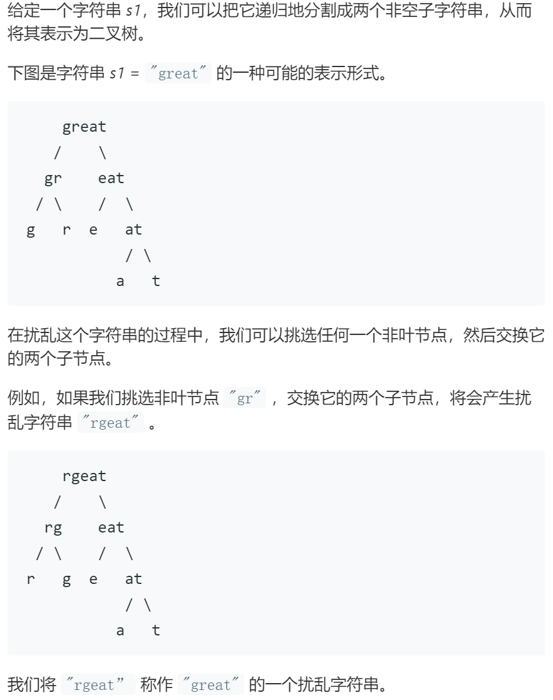
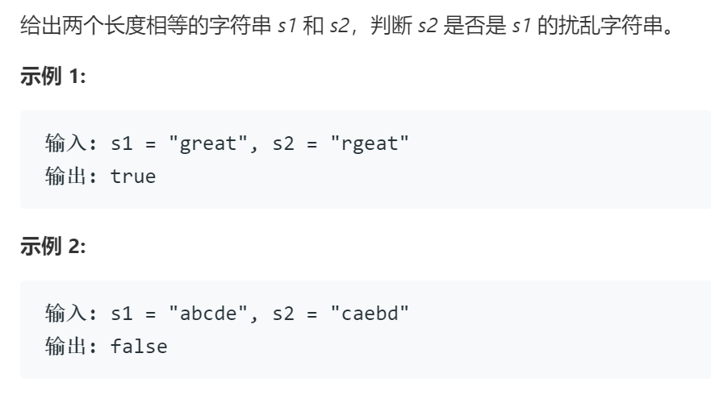

# 87扰乱字符串

## 题目

## 思路

若s1可被扰乱成s2，则满足：

1. 按字典序排序后两个字符串相等
2. 至少存在一个分割点满足以下两条之一
2.1 s1的前半部分可被扰乱成s2的前半部分，后半部分可被扰乱成s2的后半部分
2.2 s1的前半部分可被扰乱成s2的后半部分，后半部分可被扰乱成s2的前半部分

## 代码

    class Solution {
        public boolean isScramble(String s1, String s2) {
            if (s1.equals(s2)) return true;
            int[] letters = new int[26];
            for (int i = 0; i < s1.length(); i++) {
                letters[s1.charAt(i) - 'a']++;
                letters[s2.charAt(i) - 'a']--;
            }
            for (int i = 0; i < 26; i++) {
                if (letters[i] != 0) return false;
            }
            for (int i = 1; i < s1.length(); i++) {
                if (isScramble(s1.substring(0, i), s2.substring(0, i)) && isScramble(s1.substring(i), s2.substring(i)))
                    return true;
                if (isScramble(s1.substring(0, i), s2.substring(s2.length() - i)) && isScramble(s1.substring(i), s2.substring(0, s2.length() - i)))
                    return true;
            }
            return false;   
        }
    }
